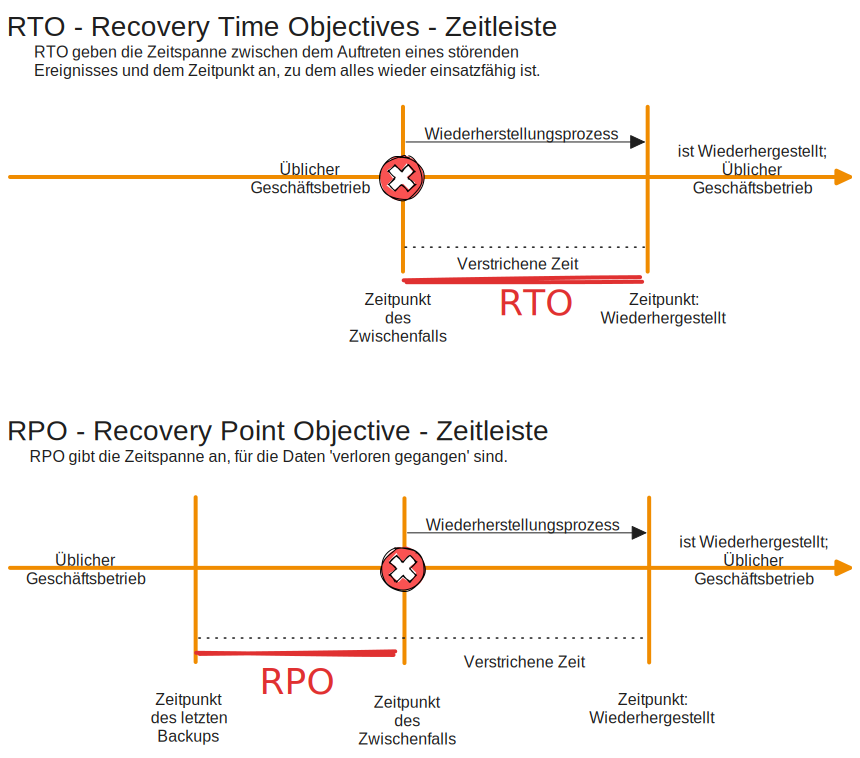

# Datensicherung

## RAID
**RAID 0:**
- Keine Datenredundanz. Also bei Ausfall Verlust
- Vorteile: hohe Transferrate / paralleles Schreiben
**RAID 1:**
- volle Redundanz (Spiegeln)
- Nachteil: Speicher Halbiert
- Vorteil: Hohe Lesegeschwindigkeit
**RAID 5:**
- Paritätsinformationen auf 1 Platte aufgeteilt. Ausfallsicherheit 1 Platte
- hohe Lesegeschwindigkeit, Schreiben leicht verringert
- Mind 3 Platten benötigt
**RAID 6:**
- 2 Paritätsplatten. Ausfallsicherheit 2 Platten

## Backup Arten
**Vollbackup:**
- Alle Daten werden ausnahmslos gesichert
- Das Achivbit wird zurückgesetzt (muss nicht ausgelesen werden da eh alles gesichert wird)
- es wird dementsprechend viel Speicher benötigt

**Differentielles Backup:**
- Alle Daten die Seit dem letzten Vollbackup verändert wurden werden gesichert
- Archivbit bleibt unverändert
- relativ viel Speicherbedarf

**Inkrementelles Backup:**
- Daten die seit dem letzten Vollbackup oder Inkrementellen Backup verändert wurden werden gesichert
- Archivbit wird zurückgesetzt
- Die Sicherungen bauen aufeinander auf
- Größe der Sicherung bleibt bei gleichmäßigem Betrieb in etwa konstant

## Backup Strategien
**3-2-1 Regel:**
- 3 - Es existieren 3 Ausführungen der Daten. Primärsystem und 2 Backups
- 2 - Die 2 Backups sind auf 2 unterschiedlichen Speichermedien. (alternativ 2 Orte)
- 1 - Eines der Backups wird offsite gelagert (z.B. Cloud)

**Großvater-Vater-Sohn Strategie:**
- Rotiert Sohn Backups alle Arbeitstage (z.B. 5 Stück) - oft inkrementelles BU
- Rotiert Vater Backups alle Woche (z.B. 4 Stück) - oft Differentielles BU
- Rotiert Großvater Backups pro Monat (z.B. 12 Stück) - oft Volbackups
- So können Backups über den Zeitraum eines ganzen Jahres gemacht werden

**Türme von Hanoi:**
- nach Festem Schema (angelehnt an Türme von Hanoi Spiel)
- mit 3 Ringen beispielhaft 1 Tag Rollback, 2 Tage, 4 Tage an einem Zeitpunkt
- mit 4 Ringen beispielhaft 1 Tag, 2, 4 und 8 Tage Rollback vorhanden

|Ring|1|2|3|4|5|6|7|8|9|
|---|---|---|---|---|---|---|---|---|---|
|A|x||x||x||x||x|
|B||x||||x||||
|C||||x||||||
|D||||||||x||

## Archivbit
- Wenn User Daten ändert, Bitflag wird 1 gesetzt.
- Nutzen bei Inkrementeller Strategie: Alles mit 1 wird gesichert. Danach 0 gesetzt
- Nutzen bei Differentieller Strategie: Alles mit 1 wird gesichert. Bleibt 1
- Nuten bei Vollbackup: Alles wird gesichert. Danach alles 0 gesetzt

## Automatisches vs Manuelles Backup
**Automatisches** BU:

|Vorteile|Nachteile|
|---|---|
|Zuverlässig|erhöhter Kontrollaufwand|
|Konsistent|Abhängig von Technik|
|Sicherheit|Ressourcenverbrauch|

**Manuelles** BU
|Vorteile|Nachteile|
|---|---|
|Bessere Kontrolle|Unzuverlässigkeit|
|Flexibel|Menschl. Versagen|
|Unabhängig|Ungenau|

## RTO vs RPO

## NAS vs SAN vs CloudStorage

### NAS-BU
unkompliziert und schnell Speicherplatz bereitstellen. Zugriff über Remote-Protokoll

|Vorteile|Nachteile|gegeignet für|
|---|---|---|
|einfache Integration|abhängigkeit von Infra|kleine strukturen|
|geringe Kosten|einzelner Speicherort|zuhause|
|schneller Zugriff|Sicherheitsrisiko|wenige Nutzer|

### SAN-BU
Fast ausschließlich in großen Unternehmensnetzwerken genutzt. Hoher Datendurchsatz/Redundanz für Unternehmenskritische Applikationen/Services

|Vorteile|Nachteile|gegeignet für|
|---|---|---|
|hohe Performance|hohe Kosten|große Infrastrukturen|
|gute Redundanz|komplexität|große Unternehmen|
|zentralisiert Verwaltbar|komplexe Einrichtung|viele Nutzer|

### Cloud-BU
|Vorteile|Nachteile|gegeignet für|
|---|---|---|
|unbegrenzt Skalierbar|benötigt gutes Internet|alle|
|hohe Redundanz|Datenschutz bedenken|alle|
|einfache Automatisierung|Langzeitkosten|alle|