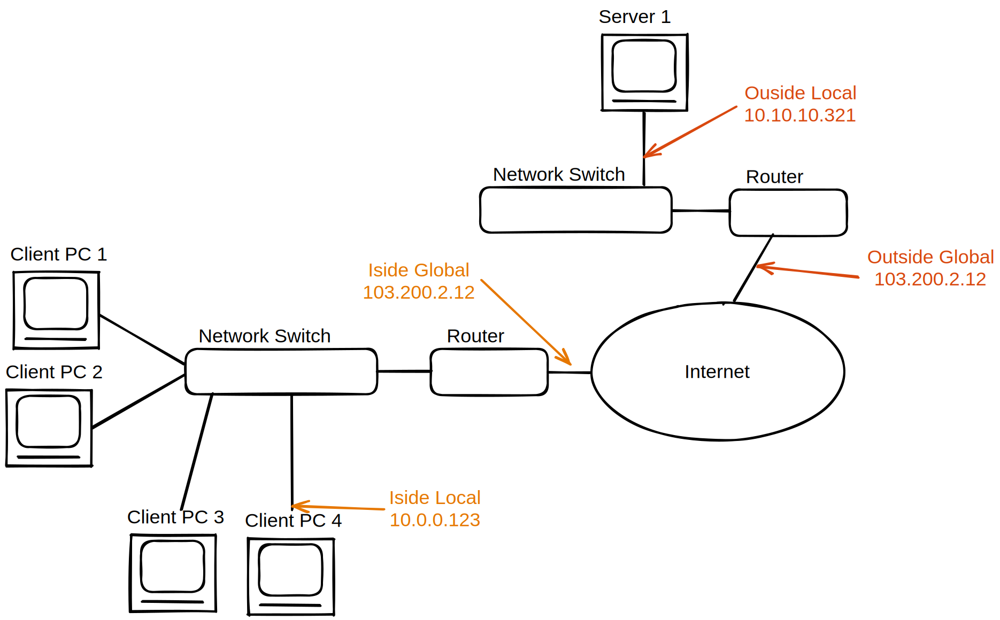
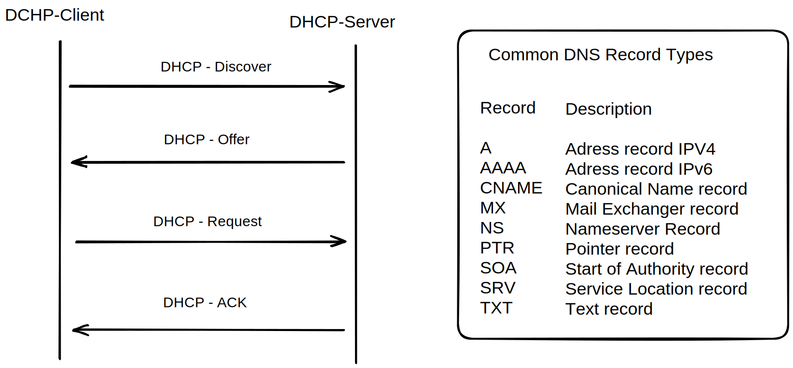

# Netzwerk

## Begriffe


**Domain Controller:**
- Server zur zentralen Verwaltung von Benutzerrechten und Authentifizierung in einem Netzwerk
- Steuerung von Rechten
- Authentifizierung von Benutzern/Pcs

**Core-Switch:**
- Zentraler und leistungsfähiger Switch
- hoher Datendurchsatz
- oft auf Redundanz ausgelegt

**Proxy Server:**
- Stellvertreter/Vermittler
- Absichern, Verschleiern einer Verbindung
- schützt Privatsphere
- bechleunigt Netzwerktraffic

**DMZ - Demilitarisierte Zone:**
- Pufferzone zwischen Internet und Intranet
- durch Firewall getrennt
- gesonderte Firewall einstellungen 

**Router:**
- Kopelelemente die Pakete zwischen verschiedenen Rechnernetzwerken weiterleiten
- Routing anhand von IP-Adressen
- Dienen oft als Gateway angeschlossener Rechner ins Internet

**Switch:**
- Koppelelemente in Rechnernetzwerken die Segmente miteinander verbinden
- werden häufig in Firmennetzwerken verwendet um ein LAN zu bilden
- Sorgen innerhalb einer Broadcast Domain, dass Datenpakete(Frames) an ihr Ziel kommen

**APIPA Adresse:**
- Autokonfiguration wenn nichts eingestellt. (vergibt sich selbst **link-local** Ip-Adresse)

**Link-Local Adresse:**
- Selbst zugewiesene Adresse (z.B. APIPA), da Zuweisung per DHCP z.B. nicht funktioniert hat (DHCP Server nicht erreichbar)
- Link Local wird für Unicast inerhal local LAN verwendet
- ipv6 `FE80::wxyz...`
- ipv4 `169.254.0.0/16`

### Betriebsmodi Switch
Store Forward:
- komplett empfangen, auswerten und prüfen, dann erst weiterleiten
- Checksum und Korrektur
- langsam

Fragment Free
- auslesen 64 Bytes
- fängt die meisten Fehler ab
- keine Fehlerkorrektur
- etwas langsamer

Cut-Trough
- wertet nur die ersten Bytes, also die MAC Adresse aus
- keine Fehlerkorrektur
- schnell

Error-Free-Cut-Through
- direkt Weiterleiten
- Kopie im Speicher anlegen, diese wird ausgewertet auf Fehler
- wenn zu viele Fehler, dynamischer Wechsel in z.B. StoreForward


### Inside vs Outside and local vs global

**inside vs outside:** - Inside the Clients Network vs not in that Network.

**local vs global:** - Private vs only reachable via the Internet



## OSI - Modell
|Schicht|Protokolle|Geräte|Nr|Beschr.|-|Addr|Störungen|
|---|---|---|---|---|---|---|--|
|Application|Http,FTP|Proxy, Load-Balancer|7|Ein/ausgabe|Daten|-|Server Config fehlerhaft|
|Presentation|Http,FTP|Proxy, Load-Balancer|6|Anwendungsdaten in Standard Formate|Daten|-|Server Config fehlerhaft|
|Session|Http,FTP|Proxy, Load-Balancer|5|Steuerung der Verbindung|Daten|-|Server Config fehlerhaft|
|Transport|TCP, UDP|Gateway|4|Zuordnung der Datenpakete|Segmente|Ports|Verlust von Packeten|
|Network|IP, ICMP|Router|3|Routing Pakete nächster Knoten|Pakete|IP|Falsche IP vergeben|
|DataLink|Ethernet, ARP|Bridge, Switch|2|Pakete in Frames, Checksums|Frames|MAC|Netzwerkkarte defekt|
|Physical|(Token Ring)|Kabel, Repeater|1|Umwandeln Bits in Physische Signale|Bits|-|Kabel defekt|


## IPv4
**Localhost IP Adressen:**
```
localhost IPv4  127.0.0.1
localhost IPv6  ::1
```

**Private IP Bereiche bei IPv4:**

|Klasse|Netzwerk||
|---|---|---|
|A|10.0.0.0/8|privat|
|B|172.16.0.0/12|privat|
|C|192.168.0.0/16|privat|
|D|240.0.0.0|multicast|

## Technologie

### NAT
#### NAT - Network Adress Translation
- Gleichzeitiges Verwenden **einer** öffentlichen IP durch mehrere Hosts. (geteilt)

**Statisches NAT:** - jede IP bekommt eine öffentliche IP (Table).

**Dynamiscches NAT:** - Pool mit rotierenden IPs. Jedoch immer noch nur soviele gleichzeitige Nutzer wie öffentliche IPs.


**PAT  - Port Adress Translation**
- wie bei NAT, nur werden Ports gezielt genutzt um sie Verbindungen/lokalen-IPs zuzuordnen
- wenn heutzutage (nicht IHK) von NAT geredet wird, wird NAT mit PAT impliziert

**NAT64 - aka. Dual Stack:**
- ipv4 und ipv6 Adressen werden kombiniert
- 4 to 6 Tunnel. Die letzten 32 Bit einer v6 Adresse werden benutzt um ipv4 zu codieren

### WLAN
|Name|Vorteile|Nachteile|geeignet|
|---|---|---|---|
|WPA|einfach|Unsicher da bei vielen Nutzern schnell geleaktes PW| für kleine Unternehmen|
|WPA-Enterprise mit RADIUS|sicherer|hohe kosten, aufwändiges Einrichten|große Unternehmen|

### DSL
**DSL** - Digital Subscriber Line

**ADSL** - asymmetric - mehr download als Upload (z.B. 10x)

**SDLS** - symmetric - genau gleiches Up und Down

**VDSL** - Very High Speed - benutzt (Super-)Vectoring. erhöht auf Kupferleitung die Max. Datenrate

||Down|Up|
|---|---|---|
|IDSN|1Mbit|1Mbit|
|SDSL|5Mbit|5Mbit|
|ADSL|10Mbit|1Mbit|
|VDSL|50Mbit|10Mbit|

## DNS
Domain Name System - Namensdatenbank die domain-namen in IP Adressen auflöst

Name-Server
- autorativer Server: für Zone zuständig (z.B. `.de` oder `.tv`)
- secondary Server: Casht Infos von anderen Name-Servern im RAM. Stellt diese zu verfügung (z.B. google's `8.8.8.8`)

## DHCP
Dynamic Host Configuration Protocol
- Automatische Vergabe von IP-Adressen für Hosts


### DORA
Beschreibt den Ablauf einer DHCP-Anfrage und DCHP-Antwort:
1. **Discover** - Client sendet UDP-Paket Broadcast (an 255.255.255.255). Dient als Adressanforderung an alle verfügbaren DHCP-Server
2. **Offer** - DHCP-Server antworten mit verfügbarer IP Konfiguration. Beinhaltet:
    - mögliche IP Adresse
    - MAC Adresse des Clients
    - Laufzeit/Lebenszeit
    - Subnetzmaske
    - IP Adresse des DHCP Servers
3. **Request** - Client sucht sich eine IP Adresse aus und sendet (per BC so wissen alle Server das er ihre/andere genomment hat)
4. **Acknowledge** - Anschließend wird die Vergabe vom DHCP Server bestätigt oder verneint. (wenn mitlerweile z.B. an anderen Client vergeben)
    - Sobald Client die Bestätigung erhalten speichert er diese lokal ab
    - Anschließend wird der TCP/IP Stack gestartet

Refresh 
- Nach hälfte der Lease Time wird versucht zu verlängern
- wenn ACK ausbleibt in immer kürzeren Intervallen nachgefragt

## VPN - Virtuelles Privates Netzwerk
- Internetverkehr in ungesicherten Netzwerken verschlüsseln
- getunnelte Verbindung
- Inhalte verschlüsseln

**Site to Site VPN:**
- Standorte oder Filialen untereinander verbinden
- z.B. Haupt mit Nebenfilialen

**End to Site VPN:**
- Endgeräte mit lokalem Netzwerk verbinden
- z.B. Homeoffize zu intranet der Firma


## VLAN - Virtual LAN
physisches LAN in voneinander isolierte logische Teile aufteilen
- Befindet sich Schicht 2 im OSI-Modell

Vorteile:
- Sicherheit
- Flexibler
- Performance (prio von z.B. VoIP)
- weniger Broadcast last
- Organisationsstrukturen abbilden

VLAN-Tag:
- enthält z.B. Priorität, vlanID. Auch VLAN-Header genannt.

VLAN-Trunking:
- Switch verwirft alle Frames die zu unbekannten VLAN-Gruppen gehören
- so lässt sich VLAN über mehrere Switches ausweiten

## xyz-Area-Networks
|||||
|---|---|---|---|
|PAN|Personal-AN|wenige Meter|USB, FrireWire, Bluetooth|
|LAN|Local-AN|Grundstücksfläche|Ethernet/WLAN|
|MAN|Metropolian-AN|Städtenetzwerk|Breitbandiges Telekommunikationsnetz|
|WAN|Wide-AN|mehrere MANs/Länder/Kontinente| meist im Besitzt einer Orga/Unternehmen|
|GAN|Global-AN|Weltumspannend|unser Internet. Glaßfaßer, Tiefseekabel, Satellit|

## Protokoll Liste
**TCP:**
- Verbindungsorientiert
- Zuverlässige Übertragung
- Flusskontrolle und automatisches Nachsenden von Paketen
- Segmentiert Pakete automatisch
- Geeignet für Datei übertragung oder Websites

**UDP:**
- Verbindungslos
- Schnelle echtzeit Übertragung
- Keine Korrekturprüfung, kein Nachsenden
- Kleine Header, Keine Segmentierung
- Geeignet für z.B. VoIP, Video Streaming

**telnet:**
- Ältester Dienst im Internet
- Vorgänger zu SSH
- Unverschlüsselt

**SSH:** - Secure Shell Protocol
- Protokoll für zugriff auf Server
- Client Server Prinzip
- Verschlüsselt

**FTP:** - File transfer Protocol
- Client kann Daten ablegen/löschen/herunterladen
- Herader enthalten Restart Markierungen

**HTTP:** - Hypertext Transfer Protocol
- Zustandsloses Protokoll
- Client Server
- GET, POST, PUT, PATCH, DELETE, HEAD, TRACE ...
- Fehlercodes - Statusmeldungen z.B. 404

**HTTP- Cookies:**
- Möglichkeit Browser anweisen Daten lokal zu speichern
- Da HTTP-zustandslos, Server kann keinen Zusammenhang wischen verschiedenen Requests herstellen. Cookies lösen dieses Problem

**SMTP:** 
- Simple Mail Transfer Protocol

**Websockets:** 
- Bidirektionale Verbindung, die offengehalten wird.

**POP:**
- Email für offline verwendung abrufen

**IMAP:**
- Wie POP, aber synchronisierung mehrerer Geräte möglich

**UDP:**
- Verbindungslos

## Mehrfachzugriffsverfahren
Ferfahren für geteilte Medien (z.B. Luft bei WLAN)

**CSMA/CA** - Carrier Sense Multiple Access with Collision Avoidance
- Prinzip, listen before you talk
- Probleme: Hidden Station Problem: Wenn 2 entfernte Stationen sich gegenseitig nicht mehr wahrnehmen, Stationen in der Mitte jedoch beide

**TDMA** - Zeit Multiplex Verfahren
- Synchrones TDMA feste Zeitslots. So jedoch viel verschwendete Bandbreite
- Asynchrones TDMA. Effizienter, aber mehr Protokollaufwand
- z.B. bei Mobilfunk (2G, Sattelit)

**FDMA** - Frequenz Multiplex#+
- Digitales Signal wird in analoges Sinus welle geändert
- Jeder Sender bekommt eigene Frequenz. Alle Senden gleichzeitig.
- Am Empfänger werden die einzelnen Frequenzen wider herausgefiltert
- z.B. Kabel Fehrnsehr, Kabel-Internet

**CDMA** - Code Divison Multiplex Verfahren
- mehrere Signale benutzen gleichen Kanal, dieser wird durch Spreizung codiert.
- Bessere Bandbreitennutzung als FDMA oder TDMA
- z.B. bei Mobilfunk (3G, UTMS)
