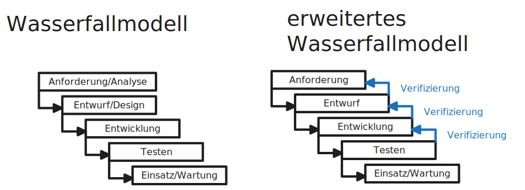
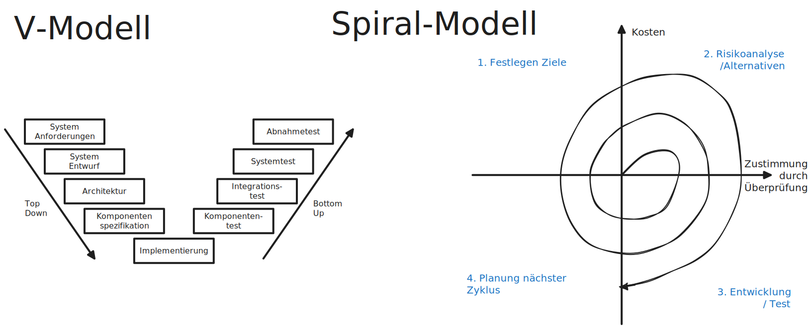

# Software Entwicklung

## Unternehmens Software 
**CRM - Customer Relationship Management**
- Strategischer Ansatz zur vollständigen Planung, Steuerung und Durchführung aller interaktiven Prozesse mit dem Kunden
- Software dient zur Dokumentation und Verwaltung von Kundenbeziehungen über einen langen Zeitraum

**BI - Business Intelligence**
- Systematische Analyse des eigenen Unternehments
- Sammlung, Auswertung, Darstellung großer Datenmengen

**ERP - Enterprise Resource Planing**
- Umfasst Kernprozesse, die zur Führung eines Unternehmens erforderlich sind
- Umfasst Prozesse und Hilfsmittel für z.B. Finanzen, Personal, Beschaffung, Logistik

### ERP - System

|||
|---|---|
|HRM|Human Ressource Management|
|CRM|Customer Relationship Management|
|SCM|Supply Chain Management|
|DMS|Dokument Management System|
|CMS|Content Management System|

### Ebenen im Unternehmen
|Ebene|System|
|---|---|
|Management Ebene|Entscheidungsunterstützungssysteme|
|Management Ebene|Management Informationssysteme|
|Strategische Ebene|Führungsunterstützungssysteme|
|Operative Ebene|Operative Systeme / Transactions Processing Systems|

## Anforderungen

### Funktionale Anforderungen
**Funktionale Anforderungen:**
- legen Fest was das Produkt tun soll
- z.B. ist Shop-Website. benötigt Warenkorb, kauf abschließen

**NICHT Funktionale Anforderungen:**
- gehen über Funktionale Anforderungen hinaus
- beschreiben *wie gut* ein Produkt die Funktionen erfüllt
- z.B.
    - wie schnell die Seite lädt
    - Lesbarkeit und Kommentare des Quellcodes
    - Konfigurierbarkeit

### Lastenheft
beschreibt die Anforderungen (vom **Kunden** erstellt)

- Enthält Spezifikationen des Kunden
- Grundlage für Angebot des Dienstleisters 
- Basis für Pflichtenheft

Aufbau:
||||
|---|---|---|
|Business Case|Warum ist Projekt notwendig?|Relaunch Webseite notwendig, da veraltet|
|Ist Zustand|Dokumentation des aktuellen Status|aktuell benutztes Framework läuft aus|
|Soll Zustand|was im allg. verbessert werden soll|Benutzbarkeit, Änderbarkeit, Übertragbarkeit, Skalierbarkeit|
|Anforderung|konkrete Auflistung was geleistet werden soll. ohne technische Implementierungs Details|komplette ausführliche Beschreibung der Website|
|Lieferumfang/Dauer d Umsetzung| Erstellung eines Zeitplans||
|Besondere/Allg. Hinweise|||
|Einzusetztende Techniken||Website mit React|
|Anlagen|Pdfs, Tabellen, Zeichnungen|| 

### Pflichtenheft
beschreibt wie die Anforderungen umgesetzt werden. (vom **Anbieter** erstellt)

- zeigt Umsetzungsmöglichkeiten
- nach Ausschlussprinzip keine Konkreten Beispiele

### SLA - Service Level Agreement
- Verfügbarkeit
- Kosten
- Reaktionszeit
- Vertragslaufzeit
- Gebuchte Dienste
- Datensicherung

## Abnahme
### Software Abnahmeprozess
- Verfahrensabgleich mit Pflichtenheft
- Bereitstellen Dokumentation/Testszenarien
- Fristenregelungen
- Behandlung von Fehlern/Mängeln

### Abnahmeprotokoll
Formales: 
- nennung von an Abnahme beteiligten Personen
- Datum/Ort und Signaturen

Haupt:
- Beschreibung des abgenommenen Produktes
- Erfüllung der Abnahmekriterien
- letzte Möglichkeit Mängel zu benennen und schriftlich festzuhalten

Mit der Abnahme beginnt die Gewährungsfrist

## Projektplanung

### Wasserfallmodell
|Vorteil|Nachteil|
|---|---|
|Einfache Struktur|wenig flexibel|
|Sichtbarer Fortschritt|spätes erkennen von Umsetzungsfehlern|
|Planungssicherheit|Bei Fehler zum Entwurf zurück|
|einfache Kalkulation von Zeit/Budget|teure Fehlerkorrektur|

### Erweitertes Wasserfall Modell
- Rücksprungsmöglichkeit in vorherige Phase
- Klassische Vorteile des Wasserfallmodells
- Mehr flexibilität

### V-Modell
|Vorteil|Nachteil|
|---|---|
|Ergänzung von Testphasen zu jeder Entwicklungsphase|recht starre Struktur|
|Minimierung von Risiken|evtl. schwer für Agile-entwicklung|
|verbesserte Produktqualität|nicht für lange oder iterative Projekte|

### Spiral-Modell
|Vorteil|Nachteil|
|---|---|
|iterativer Prozess mit beliebigen Zyklen|schlecht zu parallelisieren|
|hohe Flexibilität|hoher Aufwand, ständiges Planen/Analisieren|
|ständiges Abwägen von Risiken/Alternativen|risikoabhängiges Handeln passt nicht zu jedem Produkt|

## Compiler, Interpreter etc.
### Linker
fügt alle vom Compiler erzeugten Objektdateien zu Binary zusammen
- Zugriff zwischen Objektdateien wird aufgelöst
- greift hierfür auch auf vorcompilierte `std` Libraries zu

## Dateiformate
3 Beispiele für gängige Human Readable Textformate: 

**JSON** - Javascript Object Notation:
- Key-Value-Pairs
- Values können Js-Objekte, Arrays, Variablen etc. halten

**CSV** - Comma Separated Values:
- Textadatei ohne Steuerzeichen
- Mit Kommas getrennt
- Geeignet für strukturierte Daten (Tabellen)

**XML** - Extensible Markup Language:
- Textdatei in hierarchischer Struktur
- Elemente durch Schlüsselworte (Tags) getrennt

## Datenbanken
### Arten von DBMs - Datenbankmanagement Modelle
- Hierarchisches DBM
- Netzwerk DBM
- Relationales DBM
- Objektorientiertes DBM

### Referentielle Integrität
Verweisende Attribute z.B. Fremdschlüssel, müssen auf existierende Werte zeigen.
- in SQL könne oft Änderungen/Löschen an die Referenz weitergegeben werden. z.B. `... ON DELETE CASCADE`

### Normalformen
#### Erste Normalform
- Attribute atomar
- Frei von Wiederholungsgruppen
#### Zweite Normalform
- Jedes Nichtschlüssel Attribut von jedem Schlüsselkanidaten voll abhängig
#### Dritte Normalform
- Kein Nichtschlüssel Attribut von einem anderen Nichtschlüssel abhängig

### Anforderung an DB nach Codd
|||
|---|---|
|Datenintegration | einheitliche Verwaltung|
|Datenoperationen |Daten suchen, ändern, speichern|
|Datenkatalog|Relationen zwischen Tabellen einsehbar|
|Benutzeransichten||
|Konsistenzüberwachung||
|Zugriffskontrolle|kein unberechtigter Zugriff|
|Transaktionen|zusammenfassen und (aufeinmal) ausführen|
|Synchronisation|gleichzeitiges Benutzen muss synchronisiert werden. Also keine Beeinflussung untereinander|
|Datensicherung|Wiederherstellung von Daten nach Systemabsturz|

