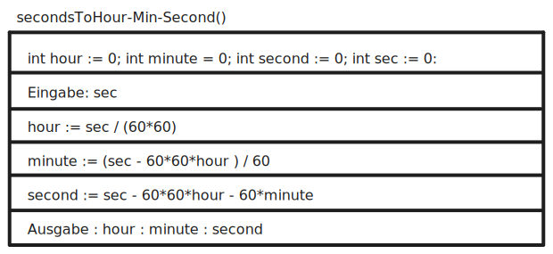

# Aufgaben Beispiele

**EPK - Ereignisgesteuerte Prozesskette**

**Struktogramm - Sekunden in Hours Minues and Seconds**

**Angebotsvergleich**

**Deckungsbeitrag**

**Netzplan**

**UML Klassendiagramm**

**UML AnwendungsfallDiagramm**
