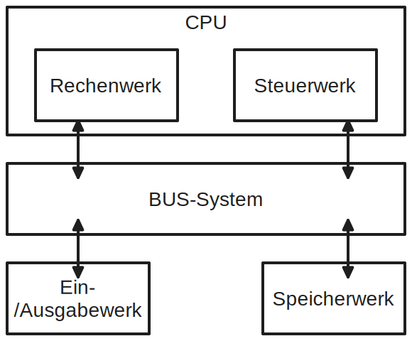
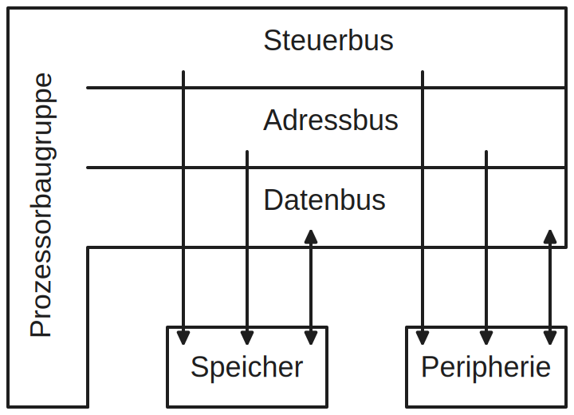

# IT Grundlagen
## Physik
- Zusammenhang Leistung
```
P  =  I  *  U 
[W] = [A] * [V]
Leistung = Stromstärke * Spannung
```
- Umrechnung Decimal vs Binär
```
8 Bit = 1 Byte
1 MiB = 1/1024 GiB
1MB = 1/1000 GB
```

## IP Adressen
```
localhost IPv4  127.0.0.1
localhost IPv6  ::1
```

## Aufbau eines Rechners
### Teile einer CPU
- IDU - Instruction Decode Unit
- ALU - Arithmetic Logic Unit
- FPU - Floating Point Unit
- EXU - Execution Unit
- COL - Controll Logic
- DC - Data Cache
- CC - Code Cache

#### Cache
L1 Cache - First Level:
- Häufigst benutzten Daten
- z.B. 80 KB groß

L2 Cache - Second Level:
- Arbeisspeicher zwischenspeichern
- Größer aber langsamer (als L1)
- z.B. 2BM groß

L3 Cache - Smart Cache:
- jeder Kern besitzt eigen L1 & L2
- L3 wird jedoch von allen Kernen geteilt
- hält zwischen Kernen die Daten konsistent
- z.B. 30 MB groß

### RISC
Reduced Instruction Set Computing.
- RISC Prozessoren verfügen über eingeschränkten Befehlssatz
- Entsprechende Programmierung vorrausgesetzt bessere Leistung als reines CISC
- Mitlerweile verschmelzung CISC und RISC zu modernen x86/x64 Prozessoren

### CPU nach Von-Neumann-Arkchitektur
gemeinsame Speichernutzung von Programmen und Daten, wordurch Speichernutzung optimiert ist. (Vorläufer z.B. Harvard-Architektur hatte extra Datenspeicher und extra Codespeicher. Hier jedoch erhöhte Framentierung des Speichers)



### Bussystem
Verbindet Komponenten (Prozessor, Controller, RAM, Eingabe...) miteinander elektrisch
- Realisiert als Bündel elektrischer Leitungen, parallel angeschlossen
- Datenbus
    - Busbreite 64 Bit - also 64 Bit gleichzeitig = 8 Byte gleichzeitig
    - Taktfrequenz neben Busbreite das andere Leistungskriterium

