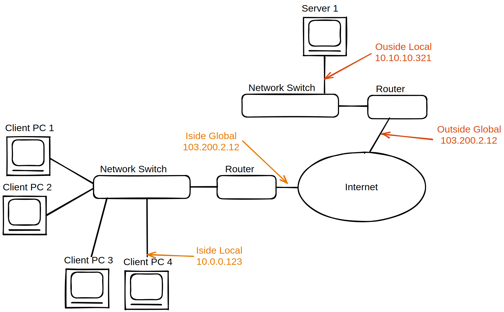
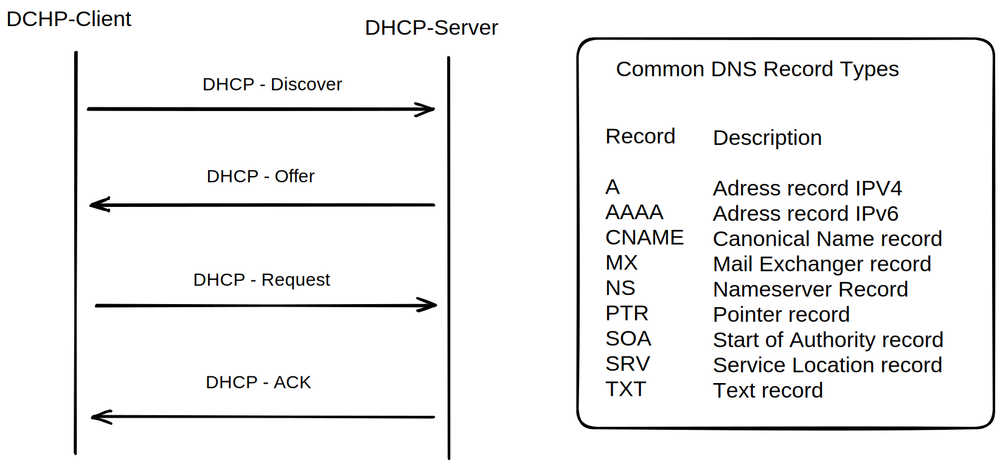

# Netzwerk

## Begriffe

**Apipa Adresse: **
- Autokonfiguration wenn nichts eingestellt. (vergibt sich selbst **link-local** Ip-Adresse)

**Domain Controller:**
- Server zur zentralen Verwaltung von Benutzerrechten und Authentifizierung in einem Netzwerk
- Steuerung von Rechten
- Authentifizierung von Benutzern/Pcs

**Core-Switch:**
- Zentraler und leistungsfähiger Switch
- hoher Datendurchsatz
- oft auf Redundanz ausgelegt

**Proxy Server:**
- Stellvertreter/Vermittler
- Absichern, Verschleiern einer Verbindung
- schützt Privatsphere
- bechleunigt Netzwerktraffic

**DMZ - Demilitarisierte Zone:**
- Pufferzone zwischen Internet und Intranet
- durch Firewall getrennt
- gesonderte Firewall einstellungen 

### Inside vs Outside and local vs global

**Inside vs Outside: ** Inside Clients Network vs not

**local vs global: ** private vs only reachable via the Internet



### Betriebsmodi Switch
Store Forward:
- komplett empfangen, auswerten und prüfen, dann erst weiterleiten
- Checksum und Korrektur
- langsam

Fragment Free
- auslesen 64 Bytes
- fängt die meisten Fehler ab
- keine Fehlerkorrektur
- etwas langsamer

Cut-Trough
- wertet nur die ersten Bytes, also die MAC Adresse aus
- keine Fehlerkorrektur
- schnell

Error-Free-Cut-Through
- direkt Weiterleiten
- Kopie im Speicher anlegen, diese wird ausgewertet auf Fehler
- wenn zu viele Fehler, dynamischer Wechsel in z.B. StoreForward


## IPv4
**Localhost IP Adressen:**
```
localhost IPv4  127.0.0.1
localhost IPv6  ::1
```

**Private IP Bereiche bei IPv4:**

|Klasse|Netzwerk||
|---|---|---|
|A|10.0.0.0/8|privat|
|B|172.16.0.0/16|privat|
|C|192.168.0.0/24|privat|
|D|240.0.0.0|multicast|

## Technologie

### NAT
#### NAT - Network Adress Translation
- Gleichzeitiges Verwenden **einer** öffentlichen IP durch mehrere Hosts. (geteilt)

**Statisches NAT:** - jede IP bekommt eine öffentliche IP (Table).

**Dynamiscches NAT:** - Pool mit rotierenden IPs. Jedoch immer noch nur soviele gleichzeitige Nutzer wie öffentliche IPs.


**PAT  - Port Adress Translation**
- wie bei NAT, nur werden Ports gezielt genutzt um sie Verbindungen/lokalen-IPs zuzuordnen
- wenn heutzutage (nicht IHK) von NAT geredet wird, wird NAT mit PAT impliziert

**NAT64 - aka. Dual Stack:**
- ipv4 und ipv6 Adressen werden kombiniert
- 4 to 6 Tunnel. Die letzten 32 Bit einer v6 Adresse werden benutzt um ipv4 zu codieren

### WLAN
|Name|Vorteile|Nachteile|geeignet|
|---|---|---|---|
|WPA|einfach|Unsicher da bei vielen Nutzern schnell geleaktes PW| für kleine Unternehmen|
|WPA-Enterprise mit RADIUS|sicherer|hohe kosten, aufwändiges Einrichten|große Unternehmen|

### DSL
DSL - Digital Subscriber Line

ADSL - asymmetric - mehr download als Upload (z.B. 10x)

SDLS - symmetric - genau gleiches Up und Down

VDSL - Very High Speed - benutzt (Super-)Vectoring. erhöht auf Kupferleitung die Max. Datenrate

||Down|Up|
|---|---|---|
|IDSN|1Mbit|1Mbit|
|SDSL|5Mbit|5Mbit|
|ADSL|10Mbit|1Mbit|
|VDSL|50Mbit|10Mbit|

## DHCP


## VPN - Virtuelles Privates Netzwerk
- Internetverkehr in ungesicherten Netzwerken verschlüsseln
- getunnelte Verbindung
- Inhalte verschlüsseln

**Site to Site VPN:**
- Standorte oder Filialen untereinander verbinden
- z.B. Haupt mit Nebenfilialen

**End to Site VPN:**
- Endgeräte mit lokalem Netzwerk verbinden
- z.B. Homeoffize zu intranet der Firma


## VLAN - Virtual LAN
physisches LAN in voneinander isolierte logische Teile aufteilen
- Befindet sich Schicht 2 im OSI-Modell

Vorteile:
- Sicherheit
- Flexibler
- Performance (prio von z.B. VoIP)
- weniger Broadcast last
- Organisationsstrukturen abbilden

VLAN-Tag:
- enthält z.B. Priorität, vlanID. Auch VLAN-Header genannt.

VLAN-Trunking:
- Switch verwirft alle Frames die zu unbekannten VLAN-Gruppen gehören
- so lässt sich VLAN über mehrere Switches ausweiten

