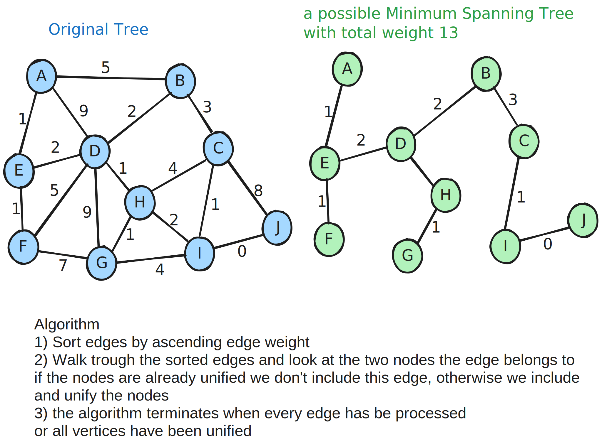

# Union Find - Disjoint Set
Data structure that keeps track of elements which are split into one or more disjoint sets.

has 2 primary operations 
- find() - For given element, tells what union that data belongs to.
- union() - merges 2 groups together.

## Usage
- image processing
- network connectivity
- least common ancestor in trees
- grid percolation - for given dots on a x/y grid, is there a path from top to bottom
- Kruskal's minimum spanning tree algorithm

## Complexity
|  |  |
|---|---|
| Construction | O(n) |
| Union | α(n) |
| Find | α(n) |
| get component size | α(n) |
| check if connected | α(n) |
| count components | O(n) |
|  |  |
- `α(n)` in amorthized constant time (almost constant, but not mathematically)

### Algorithm Kruskal's Minimum Spanning Tree
Given a graph we want to find a minimum Spanning Tree in the graph.
- A minimum spanning tree is a subset of the edges which connect all vertices in the graph with the minimal total edge cost.



## Implementation
```cs
public static class Example
{
    public static void Run()
    {
        Console.WriteLine("--- (Naive)DisjoinedSet Example: ---");
        {
            // creating an example graph (with cycle):
            //  0
            //  | \
            //  1--2
            NaiveGraph g = new NaiveGraph(3, 3);
            g.AddEdge(0, 1);
            g.AddEdge(1, 2);
            g.AddEdge(2, 0);
            Console.WriteLine(g.ToString());
            var maybe = NaiveGraph.isCycle(g) ? "a" : "no";
            Console.WriteLine($"Graph contains {maybe} cycle.");

            // creating an example grap without cycle
            var gr = new NaiveGraph(3, 3);
            gr.AddEdge(0, 1);
            gr.AddEdge(1, 2);
            Console.WriteLine(gr.ToString());
            var maybe2 = NaiveGraph.isCycle(gr) ? "a" : "no";
            Console.WriteLine($"Graph contains {maybe2} cycle.");
        }
        {
            // creating an example graph (with cycle):
            //  0
            //  | \
            //  1--2
            CompressedGraph g = new CompressedGraph(3, 3);
            g.AddEdge(0, 1);
            g.AddEdge(1, 2);
            g.AddEdge(2, 0);
            Console.WriteLine(g.ToString());
            var maybe = g.isCycle() ? "a" : "no";
            Console.WriteLine($"Graph contains {maybe} cycle.");

            // creating an example grap without cycle
            var gr = new CompressedGraph(5, 4);
            gr.AddEdge(4, 3);
            gr.AddEdge(3, 2);
            gr.AddEdge(2, 1);
            gr.AddEdge(1, 0);
            Console.WriteLine(gr.ToString());
            var maybe2 = gr.isCycle() ? "a" : "no";
            Console.WriteLine($"Graph contains {maybe2} cycle.");
        }
    }
}

public sealed class NaiveGraph
{
    private int nrVertices, nrEdges;
    private Edge[] edges;

    public NaiveGraph(int nrVertices, int nrEdges)
    {
        this.nrVertices = nrVertices;
        this.nrEdges = 0;
        this.edges = new Edge[nrEdges];

        for (int i = 0; i < nrEdges; i++)
        {
            edges[i] = new Edge();
        }
    }

    public void AddEdge(int from, int to)
    {
        if (from < 0 || to < 0 || from >= nrVertices || to >= nrVertices || nrEdges >= edges.Length)
            throw new InvalidOperationException("Not allowed to add to Graph");
        edges[nrEdges] = new Edge() { from=from, to=to };
        nrEdges++;
    }

    public override string ToString() => "{ " + String.Join(", ", edges) + " }";

    /// <summary>
    /// connections between the Vertices(=Nodes)
    /// </summary>
    private struct Edge
    {
        public int from, to;
        public override string ToString() => String.Join("",this.from, "->", this.to);
    }

    /// <summary>
    /// utility - find the subset element is a part of.
    /// </summary>
    /// <param name="parent"></param>
    /// <param name="elem"></param>
    /// <returns></returns>
    private int Find(int[] parent, int elem)
    {
        if (parent[elem] == elem)
            return elem;
        return Find(parent, parent[elem]);
    }

    /// <summary>
    /// utility - merges 2 subsets 
    /// </summary>
    /// <param name="parent"></param>
    /// <param name="x"></param>
    /// <param name="y"></param>
    private void Union(int[] parent, int x, int y)
    {
        parent[x] = y;
    }

    /// <summary>
    /// main function - to check if given Graph contains a cycle or not
    /// </summary>
    /// <param name="grap"></param>
    /// <returns></returns>
    public static bool isCycle(NaiveGraph graph)
    {
        // allocate memory for nrV subsets:
        int[] parent = new int[graph.nrVertices];
        // allocate all subsets as single element sets
        for (int i=0; i<graph.nrVertices; ++i)
            parent[i] = i;

        for (int i=0; i<graph.nrEdges; ++i)
        {
            int x = graph.Find(parent, graph.edges[i].from);
            int y = graph.Find(parent, graph.edges[i].to);

            if (x == y) return true;

            graph.Union(parent, x, y);
        }
        return false;
    }
}

/// <summary>
/// Optimisations over the Naive Implementation.
/// we use **path compression** - we flatten the tree when find() is called.
/// we use **union by rank** - always attatch the smaller depth tree under the root of the deeper tree.
/// </summary>
public sealed class CompressedGraph
{
    private int nrVertices, nrEdges;
    private Edge[] edges;

    public CompressedGraph(int nrVertices, int nrEdges)
    {
        this.nrVertices = nrVertices;
        this.nrEdges = 0;
        this.edges = new Edge[nrEdges];

        for (int i = 0; i < nrEdges; i++)
        {
            edges[i] = new Edge();
        }
    }

    public void AddEdge(int from, int to)
    {
        if (from < 0 || to < 0 || from >= nrVertices || to >= nrVertices || nrEdges >= edges.Length)
            throw new InvalidOperationException("Not allowed to add to Graph");
        edges[nrEdges] = new Edge() { from = from, to = to };
        nrEdges++;
    }

    public override string ToString() => "{ " + String.Join(", ", edges) + " }";

    /// <summary>
    /// connections between the Vertices(=Nodes)
    /// </summary>
    private struct Edge
    {
        public int from, to;
        public override string ToString() => String.Join("", this.from, "->", this.to);
    }

    /// <summary>
    /// A connected Subset of Vertices(=nodes)
    /// - Rank describes
    /// </summary>
    private struct Subset
    {
        public int parent, rank;
    }

    /// <summary>
    /// utility - find what set 'elem' belongs to.
    /// </summary>
    /// <param name="parent"></param>
    /// <param name="el"></param>
    /// <returns></returns>
    private int Find(Subset[] subsets, int el)
    {
        if (subsets[el].parent != el)
            subsets[el].parent = Find(subsets, subsets[el].parent);
        return subsets[el].parent;
    }

    /// <summary>
    /// utility - merges 2 subsets (uses union by rank)
    /// </summary>
    /// <param name="parent"></param>
    /// <param name="x"></param>
    /// <param name="y"></param>
    private void Union(Subset[] subsets, int x, int y)
    {
        int xroot = Find(subsets, x);
        int yroot = Find(subsets, y);

        if (subsets[xroot].rank < subsets[yroot].rank)
            subsets[xroot].parent = yroot;
        else if (subsets[yroot].rank < subsets[xroot].rank)
            subsets[yroot].parent = xroot;
        else
        {
            subsets[xroot].parent = yroot;
            subsets[yroot].rank++;
        }
    }

    /// <summary>
    /// main function - to check if given Graph contains a cycle or not
    /// </summary>
    /// <param name="grap"></param>
    /// <returns></returns>
    public bool isCycle()
    {
        // allocate memory for nrV subsets:
        Subset[] subsets = new Subset[nrVertices];
        // allocate all subsets as single element sets
        for (int v = 0; v < nrVertices; v++)
            subsets[v] = new Subset(){ parent = v, rank = 0 };
        // Keep looking for a cycle
        for (int e =0; e < nrEdges; e++){
            int x = Find(subsets, edges[e].from);
            int y = Find(subsets, edges[e].to);
            if (x == y) 
                return true;
            Union(subsets, x, y);
        }
        return false;
    }
}
```
