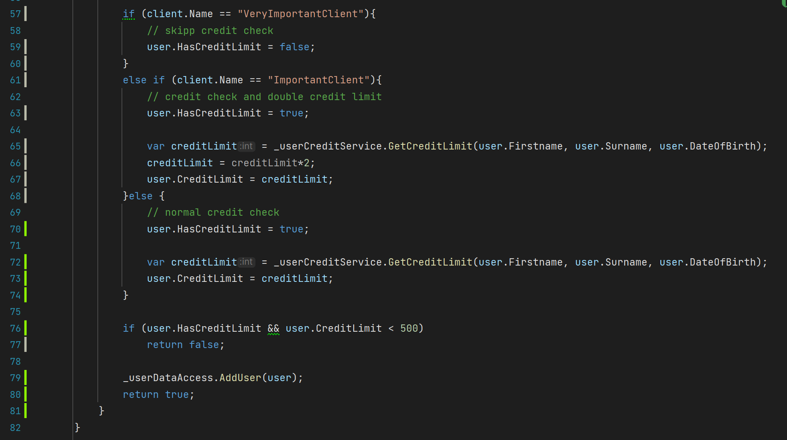

# Part 2 - Unit Testing in Csharp
create a new Project. Type `Unit Test Project` named RefactoringTest.UnitTest, with xUnit and the same dotnet version as the project.

## Definition Mocking
Classes and methods might have dependencies like actual Database connections, Databases etc.

Since we obviously do not want to spin those up or connect to real ones when testing we can use fake ones (moked ones) to simmulate the results a databse would produce etc.

## Adding libraries
- `NSubstitute` for mocking data.
- `AutoFixture` create Fake Objects easily.
- `FluentAssertions` to make assert syntax more concise


### Write the unit test for our happy-path/default-path
```cs
public class UserServiceTests
{
    /// _sut - System Under Test - just the class were testing
    private readonly UserService _sut;
    
    // Mocking our (data) providers and other Interfaces we need
    private readonly IDateTimeProvider _dateTimeProvider = Substitute.For<IDateTimeProvider>();
    private readonly IClientRepository _clientRepository = Substitute.For<IClientRepository>();
    private readonly IUserCreditService _userCreditService = Substitute.For<IUserCreditService>();
    private readonly IUserDataAccess _userDataAccess = Substitute.For<IUserDataAccess>();

    private readonly IFixture _fixture = new Fixture();
    
    public UserServiceTests()
    {
        _sut = new UserService(_dateTimeProvider, _clientRepository, _userCreditService, _userDataAccess);
    }
    
    [Fact]
    public void AddUser_ShouldCreateUser_WhenAllParametersAreValid()
    {
        /*      Arrange(Setup)     */
        
        // builds a fake client/user
        const int clientId = 1;
        var client = _fixture.Build<Client>()
            .With(c => c.Id, clientId)  
            .Create();
        var firstName = "Bob";
        var lastName = "Ross";
        var dateOfBirth = new DateTime(1992, 1, 1);
        
        // fills our Substitute Providers with data they will return
        _dateTimeProvider.DateTimeNow.Returns(new DateTime(2023, 2, 20));
        _clientRepository.GetById(clientId).Returns(client);
        _userCreditService.GetCreditLimit(firstName, lastName, dateOfBirth)
            .Returns(600);  // > 500

        /*      Act(Run our Call)     */
        
        var result = _sut.AddUser(firstName, lastName, "bob@ross.com", dateOfBirth, clientId);

        /*      Assert(that Results match Expectations)     */
        
        // we expect result of our .AddUser() to be true:
        result.Should().BeTrue();
        // we expect one our userDataAccess context to have been called exactly once:
        _userDataAccess.Received(1).AddUser(Arg.Any<User>());
    }
}
```
- go to the unit-test tab on the bottom left. Then run our newly created test.


If we want this unit test run all the time (ex when we make a commit etc.)
- right click it then `Cover Selected Unit Test`

We can now see, in our tested class `UserService.cs`, what parts of the code we have coverage for.
- And that for examples only the default path is covered. Not the (Very-)/ImportantClient


### Getting Code Coverage up
```cs
    // empty names, missing @, or to young
    [Theory]
    [InlineData("", "good", "test@test.com", 1992)]
    [InlineData("james", "", "test@test.com", 1992)]
    [InlineData("james", "good", "test.com", 1992)]     
    [InlineData("james", "good", "test@test.com", 2020)]
    public void AddUser_ShouldNotCreateUser_WhenInputDetailsInvalid(
        string firstName, string lastName, string email, int yearOfBirth)
    {
        /*      Arrange(Setup)                              */
        const int clientId = 1;
        var client = _fixture.Build<Client>()
            .With(c => c.Id, clientId)  
            .Create();

        var dateOfBirth = new DateTime(yearOfBirth, 1, 1);
        _dateTimeProvider.DateTimeNow.Returns(new DateTime(2023, 2, 20));
        _clientRepository.GetById(clientId).Returns(client);
        _userCreditService.GetCreditLimit(firstName, lastName, dateOfBirth)
            .Returns(600);

        /*      Act(Run our Call)                           */
        var result = _sut.AddUser(firstName, lastName, email, dateOfBirth, clientId);

        /*      Assert(that Results match Expectations)     */
        result.Should().BeFalse();
    }
    
    // different clients -> different credit limits calculated
    [Theory]
    [InlineData("VeryImportantClient", false, 0, 0)]
    [InlineData("ImportantClient", true, 600, 1200)]
    [InlineData("SomeRandomName", true, 600, 600)]
    public void AddUser_ShouldCreateUser_WithCorrectCreditLimit(
        string clientName, bool expectedHasLimit, int initialCreditLimit, int expectedLimitValue)
    {
        /*      Arrange(Setup)                              */
        var firstName = "Bobby";
        var lastName = "Jameson";
        const int clientId = 1;
        var client = _fixture.Build<Client>()
            .With(c => c.Id, clientId) 
            .With(c=> c.Name, clientName)
            .Create();

        var dateOfBirth = new DateTime(1992, 1, 1);
        _dateTimeProvider.DateTimeNow.Returns(new DateTime(2023, 2, 20));
        _clientRepository.GetById(clientId).Returns(client);
        _userCreditService.GetCreditLimit(firstName , lastName, dateOfBirth)
            .Returns(initialCreditLimit);

        /*      Act(Run our Call)                           */
        var result = _sut.AddUser(firstName, lastName, "test@mail.com", dateOfBirth, clientId);

        /*      Assert(that Results match Expectations)     */
        result.Should().BeTrue();
        _userDataAccess.Received().AddUser(Arg.Is<User>(user 
            => user.HasCreditLimit == expectedHasLimit
            && user.CreditLimit == expectedLimitValue));
    }
    
    // has no credit or has to low amount of limit on card -> fails
    [Fact]
    public void AddUser_ShouldNotCreateUser_WhenInvalidCredit()
    {
        /*      Arrange(Setup)                              */
        const int toLowCredit = 300;
        var firstName = "Bobby";
        var lastName = "Jameson";
        const int clientId = 1;
        var client = _fixture.Build<Client>()
            .With(c => c.Id, clientId)
            .Create();

        var dateOfBirth = new DateTime(1992, 1, 1);
        _dateTimeProvider.DateTimeNow.Returns(new DateTime(2023, 2, 20));
        _clientRepository.GetById(clientId).Returns(client);
        _userCreditService.GetCreditLimit(firstName , lastName, dateOfBirth)
            .Returns(toLowCredit);

        /*      Act(Run our Call)                           */
        var result = _sut.AddUser(firstName, lastName, "test@mail.com", dateOfBirth, clientId);

        /*      Assert(that Results match Expectations)     */
        result.Should().BeFalse();
    }
```