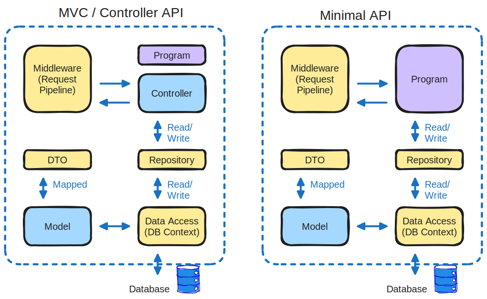
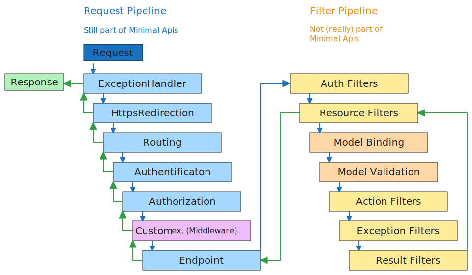

# Minimal Api compared to MVC
- https://github.com/vincepr/CS_SixMinApi

**MVC** - model-view-controller pattern. Is the old way of implementing apis in dotnet. Uses the controller model.

**Minimal APIs** - are architected to create HTTP apis with minimal dependencies. Ideal for microservices and apps that only include minimal files, features etc.



## MVC
splits program logic into three interconected elements.

- **Model** - Defines data structure (ex. the Class that shapes the JSON the users consume)
- **View** - Display of data (UI)
- **Controller** - maps requests to actions (handles routes like "/api" and what logic to call when it gets hit)

## Minimal Api
Leightweight, so some features are not supported out of the box (compared to mvc).

like:
- no model validation
- no support for JSONPatch
- no support filters
- no support for custom model binding(IModelBinder)


# Project
## Setup (no VS, only vscode)
Add libraries

```
dotnet new webapi -minimal -n SixMinApi
code -r SixMinApi                               //-r to open in same instance

dotnet dev-certs https --trust                  // generate self signed certs for 

dotnet add package Microsoft.EntityFrameworkCore
dotnet add package Microsoft.EntityFrameworkCore.Design
dotnet add package Microsoft.EntityFrameworkCore.SqlServer
dotnet add package AutoMapper.Extensions.Microsoft.DependencyInjection
```


For our server we create a `docker-compose.yaml`
```yaml
version: '3.8'
services:
  sqlserver:
    image: "mcr.microsoft.com/mssql/server:2019-latest"
    environment:
      ACCEPT_EULA: "Y"
      SA_PASSWORD: "pa55word!"
      MSSQL_PID: "Express"
    ports:
      - "1433:1433"
```

## Csharp Code

### Creating the Model
`/Models/Command.cs`

```cs
using System.ComponentModel.DataAnnotations;
namespace SixMinApi.Models
{
    public class Command
    {
        [Key]
        public int Id { get; set; }

        [Required]
        public string? HowTo { get; set; }

        [Required]
        [MaxLength(5)]
        public string? Platfrom { get; set; }
        
        [Required]
        public string? CommandLine { get; set; } 
    }
}
```
### Dtos
Dtos (Data-Transfer Object) decouples the Data-Shape of our Http-(Json)-Requests and Http-(Json)-Respones of our Api from the underlying Models that are stored in the databse.

add the neccessary Dtos (for any operations supported). Ex. the `/Dtos/CommandCreateDto.cs`
```cs
using System.ComponentModel.DataAnnotations;

namespace SixMinApi.Dtos
{
    public class CommandCreateDto
    {
        [Required]
        public string? HowTo { get; set; }

        [Required]
        [MaxLength(5)]
        public string? Platfrom { get; set; }
        
        [Required]
        public string? CommandLine { get; set; } 
    }
}
```

### Data layer
#### The public config part
in `appsettings.Development.json` we do public configuration of our sql database.
```json
{
  // ... ,
  "ConnectionStrings": {
    "SQLDbConnection" : "Server=localhost,1433;Initial Catalog=CommandDb"
  }
}
```

#### The local(hidden) config part
setup dotnet user-secrets, this part stays in the local environment

```
dotnet user-secrets init
dotnet user-secrets set "UserId" "sa"
dotnet user-secrets set "Password" "pa55sword!"
```


#### code part
`/Data/AppDbContext.cs`

```cs
using Microsoft.EntityFrameworkCore;
using SixMinApi.Models;

namespace SixMinApi.Data
{
    public class AppDbContext : DbContext 
    {
        public AppDbContext(DbContextOptions<AppDbContext> options) : base(options)
        {
            
        }
        public DbSet<Command> Commands => Set<Command>();
    }
}
```

- dependency inject the db context into the api-app
```cs
/* dependency inject our Db context into the app: */
var sqlConBuilder = new SqlConnectionStringBuilder();

// add the public infro from the appsettings.Development.json to the builder.ConnectionString
sqlConBuilder.ConnectionString = builder.Configuration.GetConnectionString("ConnectionStrings");
// add missing info (hidden in our dotnet user-secrets) to the builder.ConnectionString
sqlConBuilder.UserId = builder.Configuration["UserId"];
sqlConBuilder.Passowrd = builder.Configuration["Password"];

// dependency inject this info into our builder -> app
builder.Services.AddDbContext<AppDbContext>(options => options.UseSqlServer(sqlConBuilder.ConnectionString));
```

#### entity framework setup db
```
dotnet ef migrations add initialmigration
// only if dotnet-ef cant be found we install it with: dotnet tool install 
--global dotnet-ef
```
If successful, Migrations folder will get created. Filled with code for sql commands fitting for the Dtos

Next we create the tables in our db:
```
dotnet ef database update
```

### Auto Mapper
library that allows mapping from one object source to another object target. 
- From Model-> 
- like below or (From Dto -> Model)

`/Profiles/CommandsProfile.cs`
```cs
using AutoMapper;
using SixMinApi.Dtos;
using SixMinApi.Models;

namespace SixMinApi.Profiles
{
    // were implementing Profile from Automapper
    // to setupt quick mapping from Dtos <-> Models.Command
    public class CommandsProfile : Profile
    {
        public CommandsProfile()
        {
            // Source(Model) -> Target(Dtos.CommandReadDto)
            CreateMap<Command, CommandReadDto>();
            CreateMap<CommandCreateDto, Command>();
            CreateMap<CommandUpdateDto, Command>();
        }
    }
}
```

Not to forget to inject it into our main app. We add to our `Program.cs`
```cs
// dependency inject our AutoMapping (mapping Models -> Dtos ) to the builder
builder.Services.AddAutoMapper(AppDomain.CurrentDomain.GetAssemblies());
```
## vs MVC - Controller
- 1:30:00

## (minimal) API endpoints
### example extruded into separate file:
- `/Api/Handlers.cs`
```cs
using AutoMapper;
using SixMinApi.Data;
using SixMinApi.Dtos;
using System.Windows.Input;

namespace SixMinApi.Api
{
    public static class Handle
    {
        public async static Task<IResult> GetAllCommands(ICommandRepo repo, IMapper mapper)
        {
            try
            {
                var commands = await repo.GetAllCommands();
                return Results.Ok(mapper.Map<IEnumerable<CommandReadDto>>(commands));
            } catch (Exception ex)
            {
                return Results.Problem(ex.Message);
            }
            
        }
    }
}
```
### examples inline
- We just add the rest inline to our `Program.cs`:
```cs
// example of a Handler Function separated out to a extra file
app.MapGet("/api/v1/commands", Handle.GetAllCommands);

// example of a inline Handler Function
app.MapGet("/api/v1/{id}", async(ICommandRepo repo, IMapper mapper, int id) => {
    var command = await repo.GetCommandbyId(id);
    if (command != null) return Results.Ok(mapper.Map<CommandReadDto>(command));
    return Results.NotFound();
});

app.MapPost("api/v1/commands", async(ICommandRepo repo, IMapper mapper, CommandCreateDto cmdCreateDto) =>{
    var commandModel = mapper.Map<Command>(cmdCreateDto);
    await repo.CreateCommand(commandModel);     // this will ONLY create the command-context but not flush it down/persist it to the db
    await repo.SaveChanges();                   // this will flush all gathered changes down to our db
    // now we want to pass down the (new) id of the freshly generated entry:
    var cmdReadDto = mapper.Map<CommandReadDto>(commandModel);
    return Results.Created($"api/v1/commands/{cmdReadDto.Id}", cmdReadDto);
    // this will return a 'link' to our newly generated Command, like: api/v1/commands/12
});

app.MapPut("api/v1/commands/{id}", async (ICommandRepo repo, IMapper mapper, int id, CommandUpdateDto cmdUpdateDto) =>{
    var command = await repo.GetCommandbyId(id);
    if (command == null ) return Results.NotFound();
    mapper.Map(cmdUpdateDto, command);
    await repo.SaveChanges();
    return Results.Ok();
});

app.MapDelete("api/v1/commands/{id}", async (ICommandRepo repo, IMapper mapper, int id) => {
    var command = await repo.GetCommandbyId(id);
    if (command == null) return Results.NotFound();
    repo.DeleteCommand(command);
    await repo.SaveChanges();
    return Results.Ok();
});
```


# The Differences

## What are Filters
Filters are not supported for Minimal Apis. (though could probably be created yourself with middleware?)

- Allow to run code before or after stages in the Filter Pipeline
- each Filter Type is executed at different times in the pipeline:
	- Auth
	- Resource
	- Action
	- Exception
	- Result

- Filters Can be scoped to:
	- Globally (all Controllers, all Actions etc.)
	- to a Controller
	- to an Action
- Filters can be synchronous or async.


## Custom Model Binding - IModelBinder
Allows Controller Actions to work directly with Model Types. (rather than http requests)

- doesnt seem terribly neccessary/useful to learn atm

## Model Validation
reports business rule errors. Ex. Input string length < min allowed length.

- Out of the box with Controllers. But can be added to minimal APIs.

`CommandCreateDto.cs`
```cs
namespace SixApi.Dtos{
	public class CommandCreateDto{
		[Required]
		public string? HowTo { get; set; }

		[Required]
		[MaxLength(7)]	// this is the part we can validate against
		public string? Platform { get; set; }

		[Required]
		public string? CommandLine { get; set; }
	}
}
```

- in a MVC we get a good concise error (no request will be made to sql-db) if we try to pass in a Create Request with a Platform string that is to long
- in the minimal-api a request will be made against the db, it will fail and a huge sql-error will come back to the client.
	- a simple way to catch those could be with a try catch to check for those errors 

## Patch endpoint
- a way to only update parts for an entry in our sql db. Like the HowTo-string without chaning the others.

```cs
[HttpPatch("{id}")]
public async Task<ActionResult> PartialCommandUpdate(int id, JsonPatchDocument<CommandUpdateDto>)
{
	var commandModelFromRepo = await _repo.GetCommandById(id);
	if (commandModelFromRepo == null) return NotFound();

	var commandToPatch = _mapper.Map<CommandUpdateDto>(commandModelFromRepo
	patchDoc.ApplyTo(commandToPatch);

	if (!TryValidateModel(commandtoPatch))
	{
		return ValidationProblem(ModelState);
	}
}
```